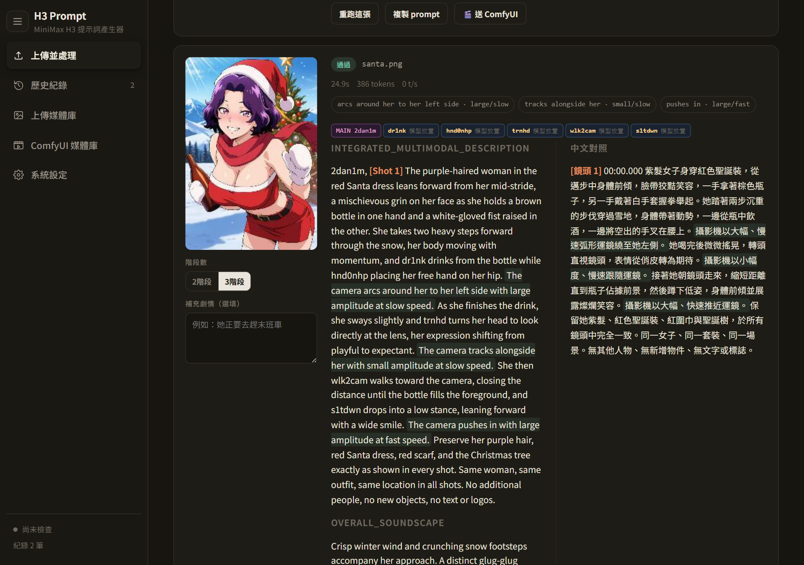
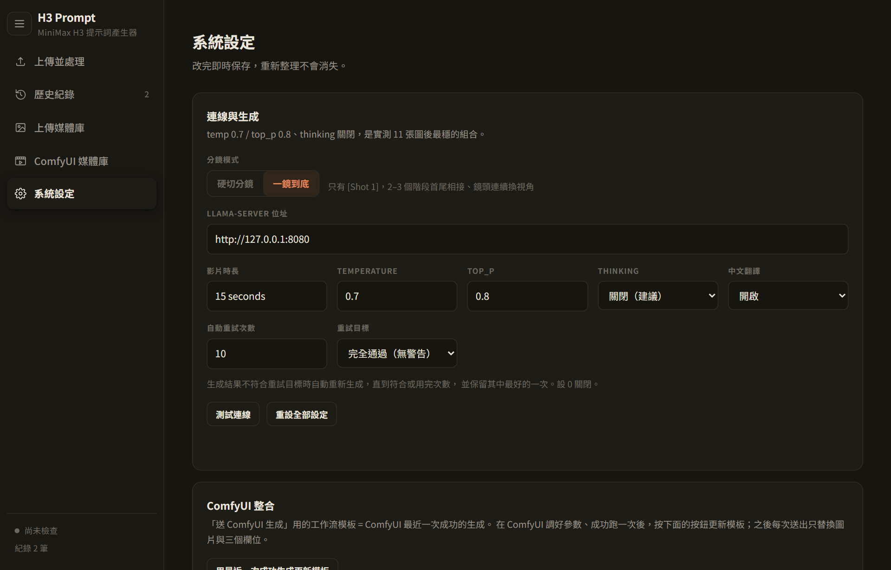
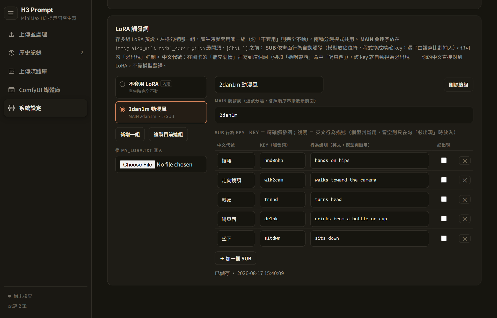
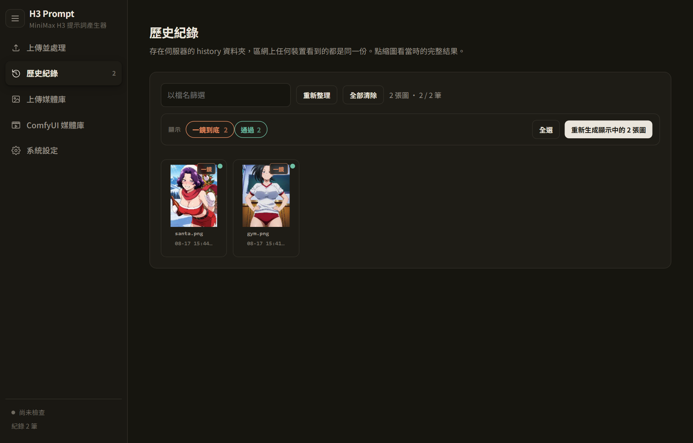
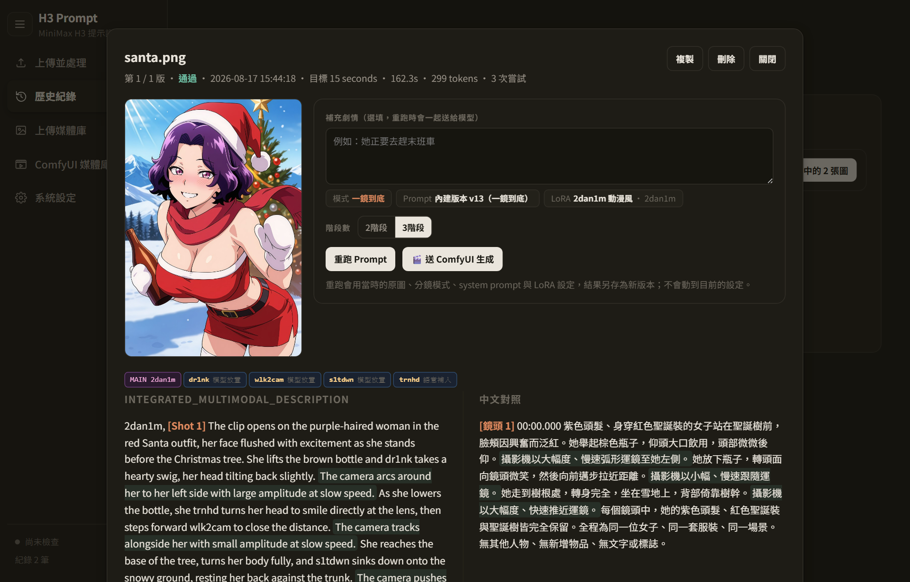
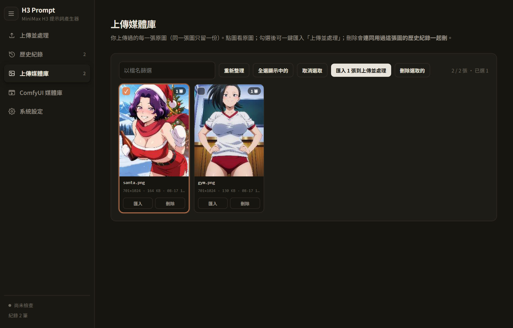
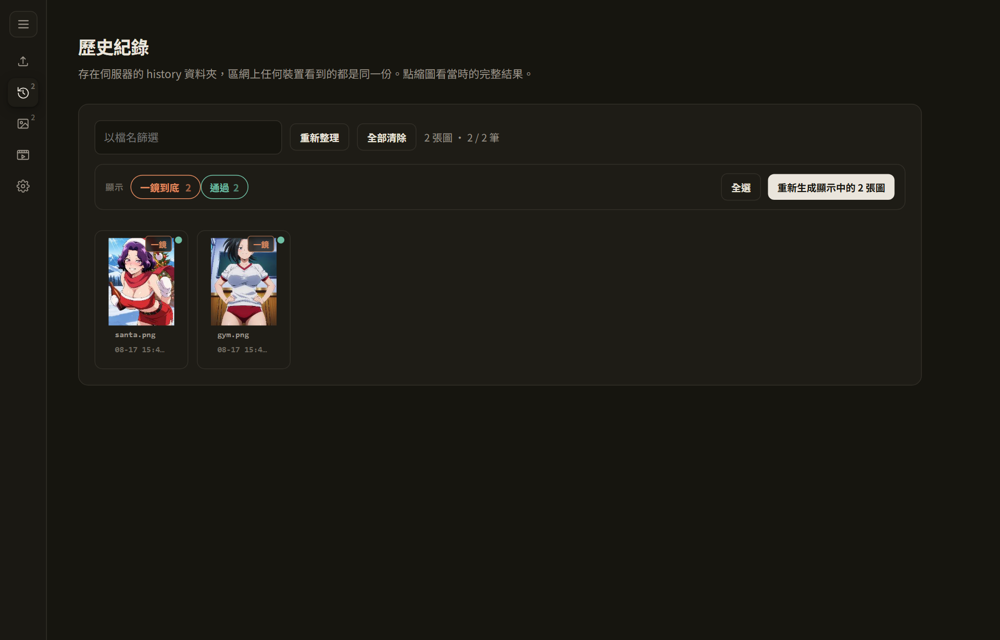
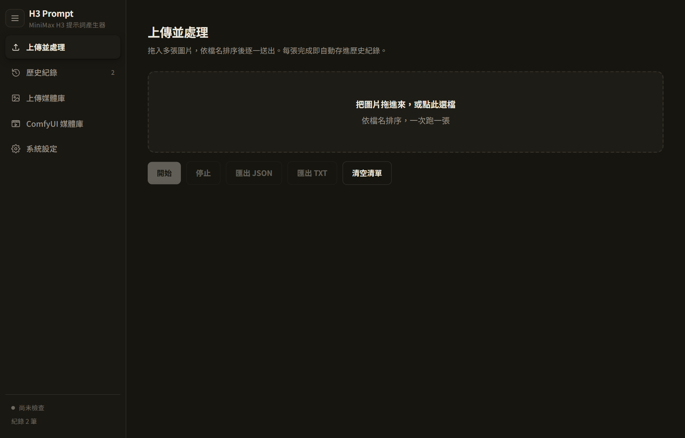

# H3 Storyboard

**把一張圖，變成 MiniMax H3 能直接吃的分鏡提示詞。**

上傳靜態圖片 → 本地視覺 LLM 讀圖、想劇情、排運鏡、配音效 → 輸出符合 MiniMax H3（Hailuo 3.0）I2VA 格式的三欄位提示詞 → 一鍵送 ComfyUI 生成。支援 **一鏡到底 / 硬切分鏡** 兩種模式，內建 **LoRA 觸發詞** 自動置入，歷史紀錄可原樣重跑。

純本地：一支 Python 檔 + 一個 HTML 檔，零依賴，跑在你自己的 llama.cpp 上。



---

## 功能

### 🎬 兩種分鏡模式，各自獨立的 System Prompt 庫

| | 一鏡到底（預設） | 硬切分鏡 |
|---|---|---|
| Shot 標記 | 只有 `[Shot 1]`，**無時間戳** | `[Shot 2] At 00:04.000` 硬切 |
| 畫面 | 2–3 個階段首尾相接、鏡頭連續換視角 | 每個鏡頭獨立重開 |
| 人物一致性 | 高（首幀錨點不中斷） | 每次切換都有漂移風險 |

在 H3 裡 `[Shot N]` 就是「硬切」——這正是多鏡頭時內容不連貫、人物跑掉的原因。一鏡到底模式用三個階段焊接（每段結束狀態 = 下段開始狀態），每階段一句運鏡、push/zoom 只留給收尾。驗證器依模式套不同規則，不合格自動重試。

兩組內建 System Prompt 與驗證器都對齊 MiniMax 官方《Video Prompt Writing Guide》：官方 20 種運鏡用語、`small|large` / `slow|fast`（中間值省略）、`(S1) says: <d>[語言] …</d>` 對白語法、風格宣告 + `<Picture 1>` 錨定、音樂不寫抽象情緒詞。對齊行（`For the target video, at 0.00 seconds…`）預設不寫，由 Director 節點自動注入。



### 🎯 LoRA 觸發詞：模型決定位置，程式決定文字

觸發詞差一個字元 LoRA 就不會啟動，而 LLM 在精確字串上不可靠。所以：

- **MAIN**（風格 / 身分觸發詞）— 逐字放在 `integrated_multimodal_description` 最開頭、`[Shot 1]` 之前。模型從沒看過它。
- **SUB**（行為觸發詞）— 模型只寫 `<<SUB:key>>` 佔位符標記「這個行為發生在這裡」，程式換成精確 key。漏了由**語意比對**從模型自己的散文補上（「sits down onto the bench」→ `s1tdwn`）。
- **中文代號** — 在「補充劇情」寫到代號（例：「她喝東西」命中「喝東西」），對應 key 自動視為必出現。你的中文直接對到 LoRA，不靠模型翻譯。
- **必出現** — 勾了就保證出現，不看畫面。

每筆結果都標示每個 key 是「模型放置」「語意補入」還是「劇情觸發」。



### 📜 歷史紀錄記住完整情境，重跑不用切設定

每筆紀錄存：分鏡模式、用的 System Prompt、LoRA 完整快照（含 MAIN、全部 SUB、勾了哪些必出現、中文代號命中）。**重跑用當時的設定，跑完自動切回你現在的設定。** 可依模式篩選；同一張圖的多個版本收合成一張卡片。



點開一筆紀錄——情境條、階段數、重跑：



### 🖼️ 上傳媒體庫 + ComfyUI 媒體庫

- **上傳媒體庫**：你上傳過的每張原圖（同內容只留一份，以 hash 去重；存全解析度，匯回處理時也用原圖），標示被幾筆紀錄使用。多選 → 一鍵匯回「上傳並處理」。刪除時可選「只從庫移除（保留歷史）」或「連同歷史一起刪」；同一張圖日後再上傳，舊紀錄自動重新掛回。
- **ComfyUI 媒體庫**：直接瀏覽 ComfyUI 的 output 資料夾，影片可預覽、下載、刪除。



### ✅ 驗證器：錯誤 / 警告 / 提示

- **錯誤（自動重試）**：官方格式違規（三欄位缺漏或順序、`[Shot N]` 編號與 `MM:SS.mmm` 時間戳、`[Shot 1]` 帶時間戳、對齊行寫錯、每句 `<d>` 都要有 `(S1)` 與 `[語言]` 標籤、旁白必須用 `says in an off-screen voiceover` 並接唇句、`<scenetrans>` 要成對、`overall_soundscape` 不可空白），以及三種會讓 I2V 崩壞的內容：鏡頭繞到人物背後、往復/高頻動作（bobbing、up and down…）、模糊詞彙（blur、haze…）。
- **警告（目標「完全通過」時才重試）**：`medium` / `moderate` 沒省略、非官方運鏡動詞（drift…）、`large amplitude` 配非 push/zoom 運鏡、音樂抽象情緒詞或解釋情緒功能、角色聽得到的音樂寫進 `non_diegetic_music`、`<d>` 內夾語氣動作、非旁白卻寫唇句、缺風格宣告、缺人數鎖定句等。
- **提示（只顯示）**：無對齊行（Director 會補）。

模型偶爾漏寫 `[Shot 1]` 標記、或在台詞前漏掉 `(S1)`（單一說話者、有明確說話動詞時），會在驗證前自動補回，不算錯誤。

兩條專案規則（官方文件沒寫、但實測必要）：**螢幕內說話的每句 `<d>` 後面必須接 `Her lips move in natural sync with the spoken words.`**（沒有這句 H3 嘴巴不會動；旁白則改接 `lips remain completely closed`），以及**補充劇情裡用「」或 "" 給的台詞必須逐字出現在 `<d>` 裡**（沒寫 = 錯誤）。

### 其他

- 一鍵送 ComfyUI：模板 = ComfyUI 最近一次成功的生成，之後每次只替換圖片、三個欄位與影片秒數
- **送 ComfyUI 的是全解析度原圖**：上傳時同時存 1024px 工作副本（給視覺模型）與原圖（jpg/png ≤ 8 MB 原樣保留；更大或其他格式轉成長邊 ≤ 3072 的 JPEG）。H3 輸出乾不乾淨取決於輸入解析度——以前送的是 1024px 副本，540p 會出現蠟筆感。歷史紀錄詳情會標示這筆是「原圖」還是「僅 1024px」
- 網頁設定的「影片時長」會一起寫進 Director 的 duration，模型寫時間戳的秒數 = ComfyUI 實際渲染的秒數
- 中文對照翻譯、批次處理、匯出 JSON / TXT
- 側欄可收合（左上三條線）
- 區網其他裝置可直接開，歷史 / 預設 / 上傳庫全部存在伺服器端



---

## 部署

### 需要什麼

| 元件 | 說明 |
|---|---|
| Python 3.10+ | 伺服器端；**無第三方套件** |
| [llama.cpp](https://github.com/ggml-org/llama.cpp) `llama-server` | 跑一個**支援視覺**的模型（實測 Qwen3-VL 系列，34B IQ4_XS 可用；需 `/v1/chat/completions` 相容 API） |
| ComfyUI（選用） | 送出生成用。需 MiniMax H3 原生節點；實測搭配 [DaSiWa MiniMax H3 Director](https://github.com/darksidewalker/ComfyUI-DaSiWa-Nodes) |
| 現代瀏覽器 | Chrome / Edge |

### 三步啟動

```bash
git clone https://github.com/acer1204/h3-storyboard.git
cd h3-storyboard
copy config.example.json config.json      # Windows；Linux/macOS 用 cp
```

編輯 `config.json`：

```json
{
  "llama_url":  "http://127.0.0.1:8080",
  "comfy_url":  "http://127.0.0.1:8188",
  "media_root": "C:/ComfyUI/output",
  "bind":       "0.0.0.0",
  "port":       9998
}
```

啟動：

```bash
python h3-server.py
```

Windows 可以直接雙擊 `start-h3-tester.bat`（會自動開瀏覽器）。打開 `http://127.0.0.1:9998/`。

參數也能用命令列覆蓋（優先於 `config.json`）：

```bash
python h3-server.py --llama http://192.168.1.10:8080 --comfy http://127.0.0.1:8188 --media-root D:/ComfyUI/output --port 9998
```

或環境變數 `H3_LLAMA_URL` / `H3_COMFY_URL` / `H3_MEDIA_ROOT` / `H3_PORT`。

### llama-server 建議參數

```bash
llama-server -m <vision-model>.gguf --mmproj <mmproj>.gguf -c 16384 --port 8080 --host 0.0.0.0
```

前端送請求時會帶 `chat_template_kwargs: {"enable_thinking": false}`——**思考模式必須關**，否則回應會是空字串。

### 資料放哪

全部在專案資料夾內，都被 `.gitignore` 排除：

```
history/    每筆生成（1024px 工作副本、縮圖、全解析度原圖 *.orig.*）
uploads/    上傳庫（以內容 hash 去重；含原圖）
loras/      LoRA 預設
prompts/    自訂 System Prompt
config.json 你的個人設定
```

---

## 使用

### 1. 上傳並處理

拖多張圖進來（依檔名排序後逐一送出）。每張圖卡上可以：

- **階段數 / 鏡頭數**：一鏡到底選 2 或 3 階段；硬切選 1–4 鏡
- **補充劇情（選填）**：中文即可，寫**動作**不寫情緒、寫**畫面裡有的**東西、一句話一到兩個動作。想觸發 LoRA 就寫該行為的中文代號。要指定台詞就用引號：`她轉頭說「見ててね！」`——引號裡的字會逐字進 `<d>`（原語言、不翻譯）。

  ```
  她把瓶子舉起來喝東西，然後坐下。
  ```

按「開始」。不合格會自動重試（次數與目標在系統設定），每張完成即存進歷史。



### 2. 輸出長什麼樣

三個欄位，直接貼進 MiniMax H3 Director 對應的三個文字框：

```
integrated_multimodal_description: 2dan1m, [Shot 1] The purple-haired woman ... lifts the
brown bottle and dr1nk takes a hearty swig ... The camera arcs around her to her left side
with large amplitude at slow speed. As she lowers the bottle, she trnhd turns her head ...
The camera tracks alongside her with small amplitude at slow speed. ... Preserve her purple
hair, red Santa dress ... No additional people, no new objects, no text or logos.

overall_soundscape: ...

non_diegetic_music: ...
```

- 對齊行（`For the target video, at 0.00 seconds…`）預設不寫（Director 節點會注入）；要模型自己寫就在補充劇情加一句 `full prompt`
- 一鏡到底：只有一個 `[Shot 1]`，每階段一句 `The camera <官方運鏡> with small|large amplitude at slow|fast speed.`
- 硬切：`[Shot 2] At 00:04.000, the camera cuts to …`，每鏡一句運鏡，`large amplitude` 只配 push in / zoom in
- 兩種模式的移動鏡頭預設都寫滿 `with small amplitude at slow speed`（官方允許省略＝medium/normal，但 normal 速度是 I2V 動態模糊的來源，所以這裡一律寫 slow）
- LoRA：MAIN 在最前面，SUB key 緊鄰對應動作

### 3. 系統設定

- **分鏡模式**：一鏡到底 / 硬切分鏡。切換後 System Prompt 清單跟著換，各自可以新增 / 複製 / 刪除 / 從 .txt 匯入。內建兩組可直接用。
- **LoRA 觸發詞**：存多組預設，左邊勾哪一組就套哪一組。每個 SUB 一列：中文代號 / KEY / 英文行為說明 / 必出現。也可從文字檔匯入，格式：

  ```
  Trigger Main: 2dan1m
  Trigger Sub: dr1nk=drinks from a bottle or cup|喝東西, s1tdwn=sits down|坐下, ohgm
  ```

  （`key=說明|中文代號`；沒說明的 key 只在勾「必出現」時放入）
- **影片時長 / 重試**：一鏡到底 3 階段建議 `15 seconds`；重試目標「無錯誤即可」比「完全通過」少跑很多。

### 4. 歷史紀錄

- 頂端可依 **一鏡到底 / 硬切分鏡** 與 通過 / 警告 / 錯誤 篩選
- 點卡片開詳情：情境條顯示當時的模式 / Prompt / LoRA；改補充劇情或階段數後按「重跑 Prompt」→ **用當時的設定**跑，結果另存新版本
- 「送 ComfyUI 生成」：換圖（全解析度原圖）+ 三欄位 + 影片秒數，其餘照模板
- 「重新生成顯示中的」：批次重跑，每筆各用自己的情境

### 5. 上傳媒體庫

勾選 → 「匯入 N 張到上傳並處理」；「刪除」跳三選：只從庫移除（保留歷史）/ 連同歷史一起刪 / 取消。

---

## 檔案

```
h3-server.py                    伺服器（歷史 / 上傳庫 / LoRA / Prompt / ComfyUI 橋接 / 媒體庫）
h3-batch-tester.html            前端（單一檔案）
h3-lora.js                      LoRA 觸發詞引擎（佔位符解析、MAIN 置頂、語意補入、中文代號）
SYSTEM_PROMPT_ONETAKE_v14_web.txt   一鏡到底內建 System Prompt（官方規範對齊）
SYSTEM_PROMPT_CUTS_v7_web.txt       硬切分鏡內建 System Prompt（官方規範對齊）
comfy-template.json             ComfyUI 送出模板（範例，會被「更新模板」覆蓋）
config.example.json             設定範例 → 複製成 config.json
start-h3-tester.bat             Windows 啟動器
```

## 授權

MIT
